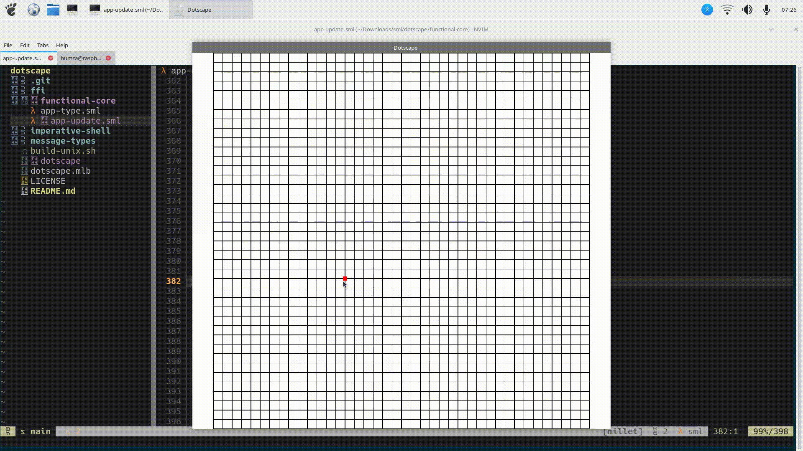

# dotscape

## What is this?

Dotscape is a simple GUI program for composing 2D shapes out of triangles and exporting them to code for use with OpenGL or other graphics libraries.

## Why

I wanted to create glyphs in OpenGL for one of my other projects. 

I coded vectors for 'A' and 'B' (containing 72 elements and 128 elements respectively), but the process was time consuming. 

I wanted there to be a lightweight GUI editor specialised for creating 2D shapes that can be exported as code for use with OpenGL, and that's what this project is for.

## Demo

## Building

### Build requirements

Dotscape has only been tested on aarch64-linux (a Raspberry Pi 5) but it may work on other platforms.

Requirements include:

- The [MLton](https://github.com/mlton/mlton) compiler for Standard ML
- OpenG ES 3.0
- The [GLFW](https://github.com/glfw/glfw) windowing library

The last two requirements may be a bit malleable because the project follows the [Functional Core, Imperative Shell](https://hummy123.github.io/2024/06/20/Functional-Core,-Imperative-Shell.html) architecture, maintaining a strict separation between pure and impure code.

### How to build

1. `git clone https://github.com/hummy123/dotscape`
2. `cd dotscape`
3. `./build-unix.sh`
4. `./dotscape`

## To do

This isn't an exhaustive list, but these are some features I would like to add to this project at some point from the top of my head.

- [x] Display clicked positions
- [x] Redraw components when resized
- [x] Support undo (with `<Ctrl-z>`) and redo (with `<Ctrl-y>` or `<Ctrl-Shift-z>`)
- [x] Save drawn project to a custom file format and allow reloading
- [ ] Export to code 
  - Possibly different options like creating a flat array/vector or an index buffer
- [ ] Linear interpolation 
  - Instead of exporting a vector, export a function which takes `(xPos, yPos, xLength, yLength)` arguments and lengths and returns a vector where the object is fitted in these coordinates.
- [ ] Add right-side panel 
  - With options (like adjusting x/y coordinates in a number input, possibly layers, selecting export options...)
- [ ] Support setting more z coordinates and (r,g,b,a) colour values.

There's quite a bit to do!
